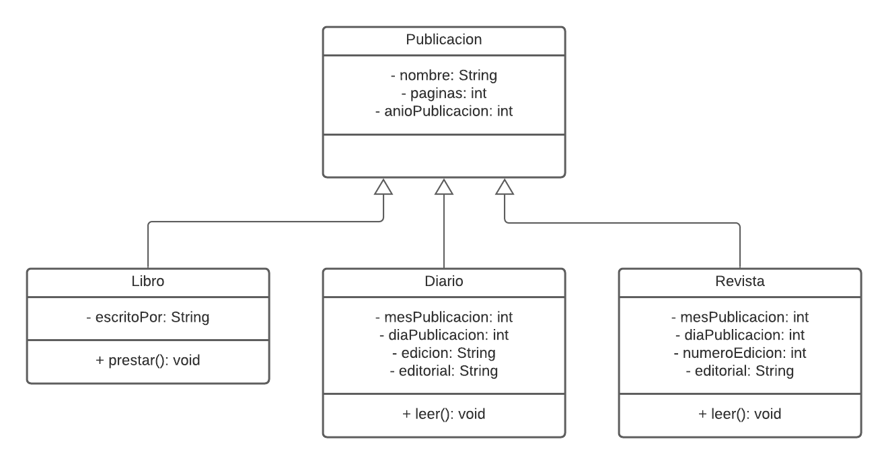

Actividades del día 2, semana 6.

(Martes 1 de junio de 2021)

---

El día de hoy practicamos el uso de una clase abstracta y la implementación de sus métodos abstractos en subclases, y la definición de requisitos de un sistema y su correspondiente diagrama de clases.

Las clases abstractas son clases que no pueden ser instanciadas, pero otras clases concretas sí pueden heredar de ellas y ser instanciadas. Los métodos abstractos no tienen cuerpo, sino que su contenido se debe definir en clases concretas que hereden de la superclase abstracta.

---

### 1. Crear una superclase abstracta Persona con sus respectivos atributos y métodos, y luego crear subclases de ella.

#### 1. `Persona.java`
```Java
public abstract class Persona
{
	private String nombre;
	private int anioNacimiento;
	
	public abstract void actuar();
	
	public Persona(String nombre, int anioNacimiento)
	{
		this.nombre = nombre;
		this.anioNacimiento = anioNacimiento;
	}

	public String getNombre()
	{
		return nombre;
	}

	public void setNombre(String nombre)
	{
		this.nombre = nombre;
	}

	public int getAnioNacimiento()
	{
		return anioNacimiento;
	}

	public void setAnioNacimiento(int anioNacimiento)
	{
		this.anioNacimiento = anioNacimiento;
	}
}
```

#### 2. `MalaPersona.java`

```Java
public class MalaPersona extends Persona
{
	public MalaPersona(String nombre, int anioNacimiento)
	{
		super(nombre, anioNacimiento);
	}
	
	public void actuar()
	{
		System.out.println(this.getNombre() + ": ¡Te vengo a atacar! o=(¬_¬ o)");
	}
}
```

#### 3. `BuenaPersona.java`

```Java
public class BuenaPersona extends Persona
{
	public BuenaPersona(String nombre, int anioNacimiento)
	{
		super(nombre, anioNacimiento);
	}
	
	public void actuar()
	{
		System.out.println(this.getNombre() + ": ¡Te vengo a ayudar! \\(^_^)/");
	}
}
```

#### 4. `Mutar.java`

```Java
public class Mutar {

	public static void main(String[] args)
	{
		Persona persona = new MalaPersona("Mala Persona", 2019);
		persona.actuar();
		System.out.println("\n- " + persona.getNombre()
							+ " ha mutado y se ha puesto buena persona. - \n");
		persona = new BuenaPersona("Buena persona", 2020);
		persona.actuar();
	}	
}
```


---

### 2.Pensar en una problemática cuya solución sea la implementación de un software (especificar requerimientos funcionales y clases en esa solución).

#### Problema:

 Una biblioteca necesita un software para registrar las publicaciones con las que cuenta.

#### Requisitos funcionales:

- El sistema debe registrar la información de las publicaciones con las que la biblioteca cuenta.

- El sistema debe ser capaz de clasificar las publicaciones en 3 tipos: libros, diarios y revistas.

- Los libros pueden ser prestados para sacarlos de la biblioteca, pero los diarios y revistas sólo pueden ser leídos en la biblioteca.

- Cada tipo de publicación debe ser registrado con sus atributos respectivos. Los libros tienen nombre (título), autor o autora, cantidad de páginas, año de publicación y editorial. Los diarios tienen nombre, cantidad de páginas, año de publicación, mes de publicación, día de publicación y edición (por ejemplo: matutina, vespertina, etc). Las revistas tienen nombre o título, cantidad de páginas, año de publicación, mes de publicación, día de publicación, número de edición y editorial.

#### Diagrama de clases


