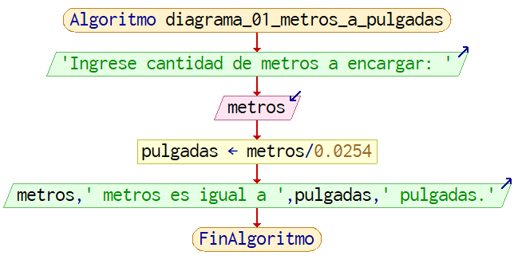
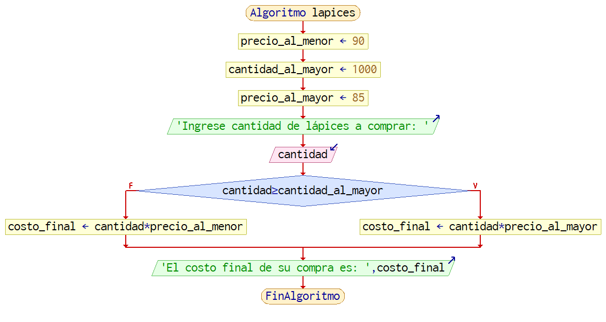
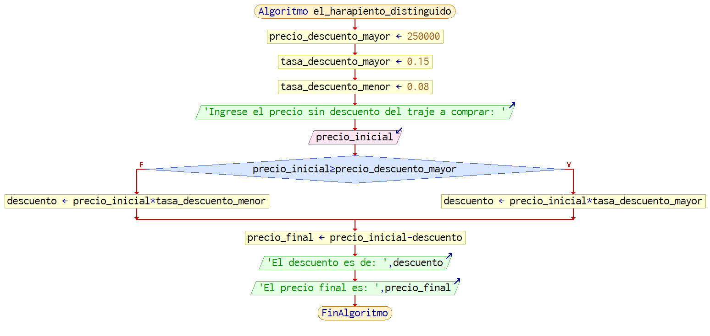
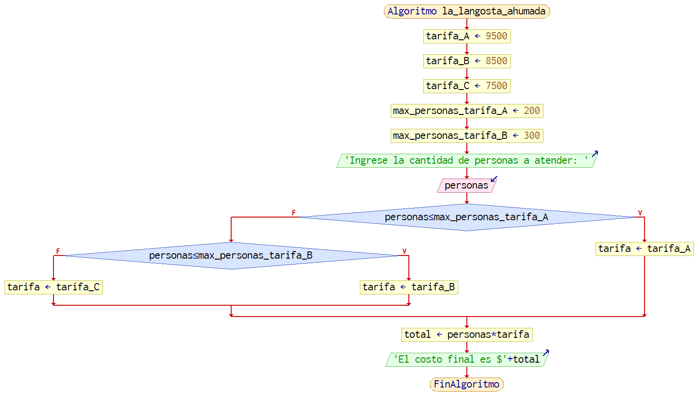
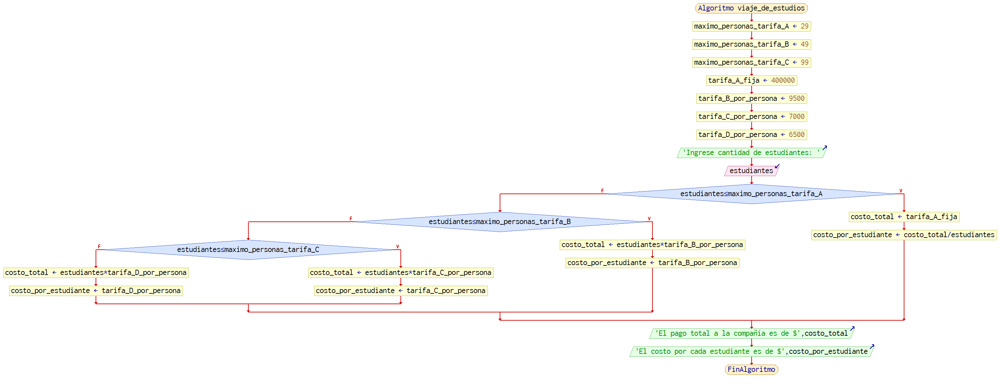
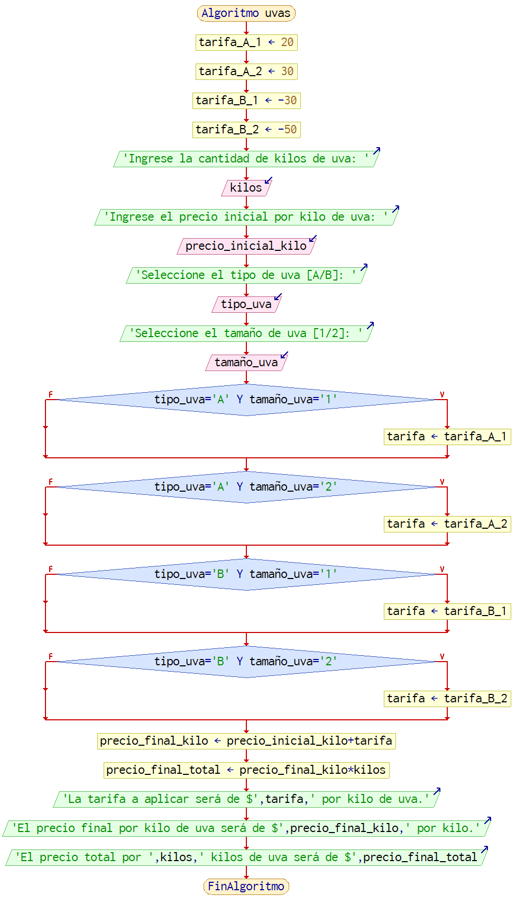

Actividades del día 5, semana 2.

(Viernes 7 de mayo de 2021)

---

#### 1. Una modista encarga telas al extranjero para elaborar sus prendas. Para cada pedido tiene que proporcionar las medidas de la tela en pulgadas, pero ella generalmente las tiene en metros. Realice un algoritmo y diagrama de flujo para ayudar a resolver el problema y determinar cuántas pulgadas debe pedir con base en los metros que requiere. Considere que 1 pulgada = 0,0024 metros.

```
    escribir "Ingrese cantidad de metros a encargar: "
    leer metros
    pulgadas = metros / 0.0254
    escribir metros + " metros es igual a " + pulgadas + " pulgadas."
```




#### 2. Realice un algoritmo y diagrama de flujo para determinar cuánto se debe pagar por X cantidad de lápices, considerando que si son 1000 ó más el costo es de 85$. De lo contrario, el precio es de $90.

```
    precio_al_menor = 90
    cantidad_al_mayor = 1000
    precio_al_mayor = 85
    escribir 'Ingrese cantidad de lápices a comprar: '
    leer cantidad
    si cantidad >= cantidad_al_mayor
      costo_final = cantidad * precio_al_mayor
    si no
      costo_final = cantidad * precio_al_menor
    fin si
    escribir 'El costo final de su compra es: ' + costo_final
```




#### 3. Almacenes "El Harapiento Distinguido" tiene una promoción: a todos los trajes que tienen un precio superior a $250000 se les aplicará un descuento de 15%, a todos los demás se les aplicará sólo 8%. Realice un algoritmo y diagrama de flujo para determinar el precio final que debe pagar una persona por comprar un traje y de cuánto es el descuento que obtendrá.

```
    tasa_descuento_menor = o.08
	tasa_descuento_mayor = 0.15
	precio_minimo_descuento_mayor = 250000    

    escribir "Ingrese el precio sin descuento del traje a comprar: "
    leer precio_inicial

    si precio_inicial >= precio_minimo_descuento_mayor
      descuento = precio_inicial * tasa_descuento_mayor
    si no
      descuento = precio_inicial * tasa_descuento_menor
    fin si

    precio_final = precio_inicial - descuento

    escribir "El descuento es de $" + descuento
    escribir "El precio final es $" + precio_final
```




#### 4. "La Langosta Ahumada" es una empresa dedicada a ofrecer banquetes. Sus tarifas son las siguientes: el costo de un platillo por persona es de $9500, pero si el número de personas es mayor a 200 pero menor o igual a 300, el costo es de $8500. Para más de 300 personas el costo por platillo es de $7500. Se requiere un algoritmo y diagrama de flujo que ayude a determinar el presupuesto que se debe presentar a las personas que deseen realizar un evento.

```
    tarifa_A = 9500
    tarifa_B = 8500
    tarifa_C = 7500

    max_personas_tarifa_A = 200
    max_personas_tarifa_B = 300

    escribir "Ingrese cantidad de personas a atender: "
    leer personas

    si personas <= max_personas_tarifa_A
      tarifa = tarifa_A
    si no
      si personas <= max_personas_tarifa_B
        tarifa = tarifa_B
      si no
        tarifa = tarifa_C
      fin si
    fin si

    total = personas * tarifa

    escribir "El costo final es $" + total
```




#### 5. El director de una escuela está organizando un viaje de estudios y requiere determinar cuánto debe cobrar a cada estudiante y cuánto debe pagar a la compañía de viajes por el servicio. La forma de cobrar es la siguiente: si son 200 estudiantes o más, el costo por estudiante es de %6500. De 50 a 99 estudiantes, el costo es de $7000. De 30 a 49, de $9500. Si son menos de 30, el costo de la renta del autobús es de $400000, sin importar el número de estudiantes.

#### Realice un algoritmo y diagrama de flujo que permita determinar el pago a la compañía de autobuses y lo que debe pagar cada estudiante por el viaje.

```
    maximo_personas_tarifa_A = 29
    maximo_personas_tarifa_B = 49
    maximo_personas_tarifa_C = 99

    tarifa_A_fija = 400000
    tarifa_B_por_persona = 9500
    tarifa_C_por_persona = 7000
    tarifa_D_por_persona = 6500

    escribir "Ingrese cantidad de estudiantes: "
    leer estudiantes

    si estudiantes <= maximo_personas_tarifa_A
	    costo_total = tarifa_A_fija
	    costo_por_estudiante = costo_total / estudiantes
    si no
      si estudiantes <= maximo_personas_tarifa_B
        costo_total = estudiantes * tarifa_B_por_persona
        costo_por_estudiante = tarifa_B_por_persona
      si no
        si estudiantes <= maximo_personas_tarifa_C
          costo_total = estudiantes * tarifa_C_por_persona
          costo_por_estudiante = tarifa_C_por_persona
        si no
          costo_total = estudiantes * tarifa_D_por_persona
          costo_por_estudiante = tarifa_D_por_persona
        fin si
      fin si
    fin si

    escribir "El pago total a la compañía es de $" + costo_total
    escribir "El costo por cada estudiante es de $" + costo_por_estudiante
```




#### 6. La asociación de vinicultores tiene como política fijar un precio inicial al kilo de la uva, la cual se clasifica en tipos A y B, y además en tamaños 1 y 2. Cuando se realiza la venta del producto ésta es de un sólo tipo y tamaño. Se requiere determinar cuánto recibirá un productor por la uva que entrega en un embarque, considerando lo siguiente: si es de tipo A, se le cargan $20 al precio inicial cuando es de tamaño 1 y $30 si es de tamaño 2. Si es de tipo B, se rebajan $30 cuando es de tamaño 1 y $50 cuando es de tamaño 2. Realice un algoritmo en pseudocódigo y un diagrama de flujo para determinar la ganancia obtenida.

```
    tarifa_A_1 =  20
    tarifa_A_2 =  30
    tarifa_B_1 = -30
    tarifa_B_2 = -50

    escribir "Ingrese la cantidad de kilos de uva: "
    leer kilos
    escribir "Ingrese el precio inicial por kilo de uva: "
    leer precio_inicial_kilo

    escribir "Seleccione el tipo de uva [A/B]: "
    leer tipo_uva
    escribir "Seleccione el tamaño de uva [1/2]: "
    leer tamaño_uva

    si tipo_uva = "A" y tamaño_uva = "1"
      tarifa = tarifa_A_1
    fin si

    si tipo_uva = "A" y tamaño_uva = "2"
      tarifa = tarifa_A_2
    fin si

    si tipo_uva = "B" y tamaño_uva = "1"
      tarifa = tarifa_B_1
    fin si

    si tipo_uva = "B" y tamaño_uva = "2"
      tarifa = tarifa_B_2
    fin si

    precio_final_kilo = precio_inicial_kilo + tarifa
    precio_final_total = precio_final_kilo * kilos

    escribir "La tarifa a aplicar será de $" + tarifa + " por kilo de uva."
    escribir "El precio final por kilo de uva será de $" + precio_final_kilo
    escribir "El precio total por " + kilos + " de uva será de $" + precio_final_total
```

