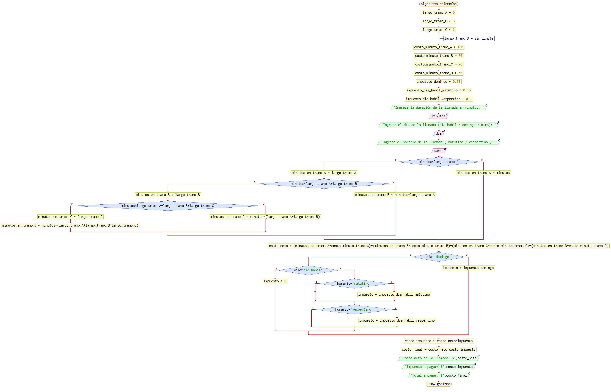
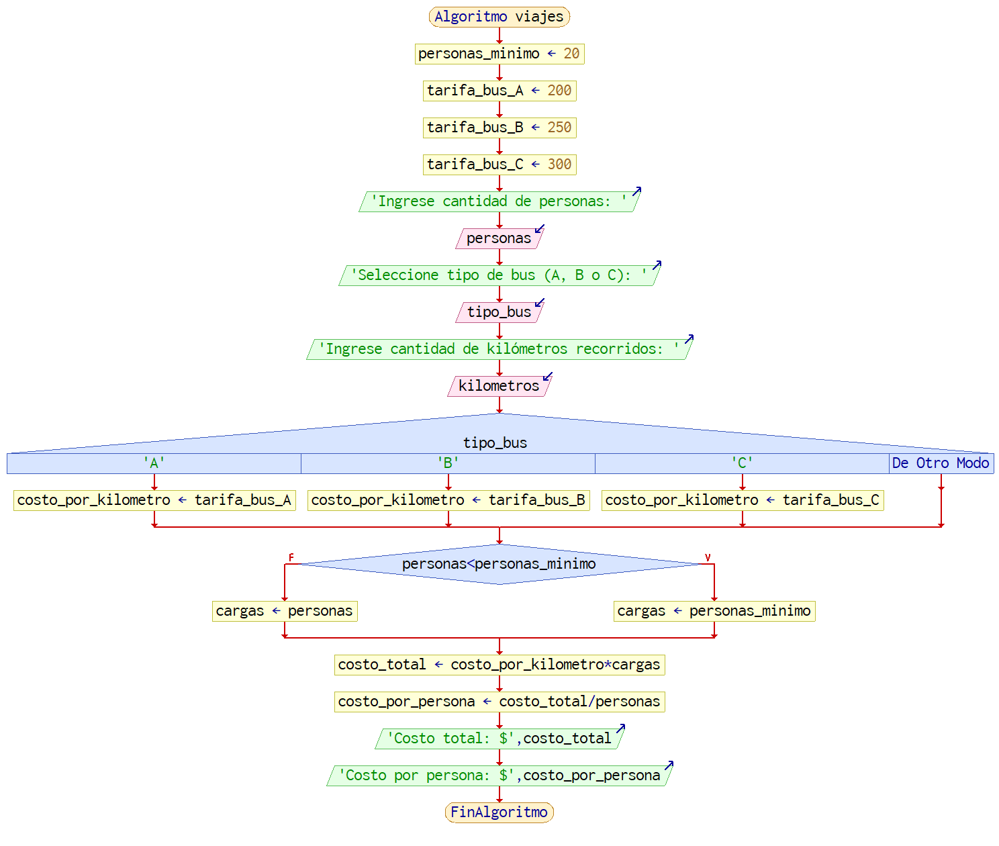
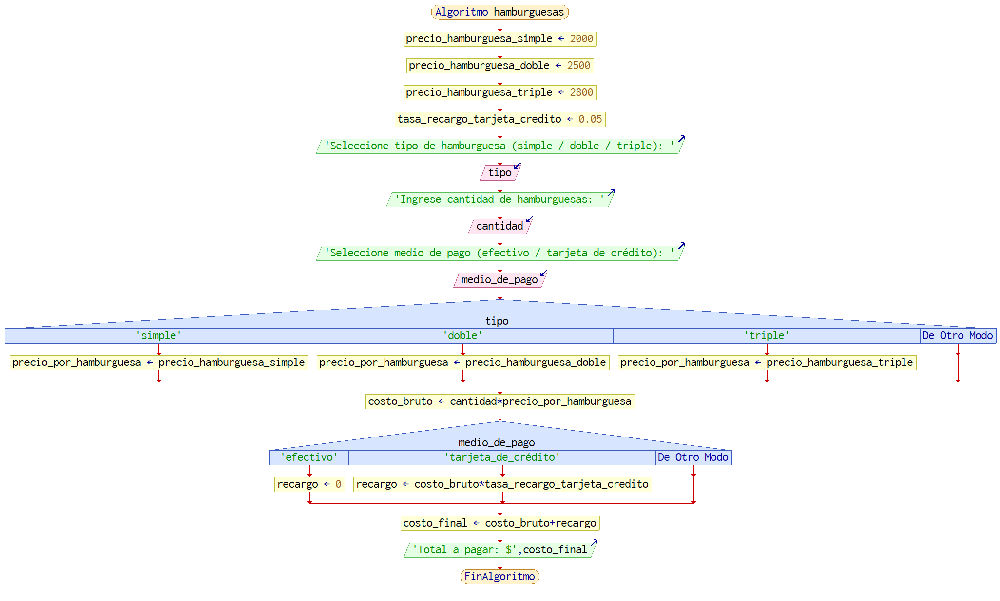

Actividades del día 1, semana 3.

(Lunes 10 de mayo de 2021)

---

#### 1. La política de la compañía telefónica "Chismefón" es "Chismea + x -". Cuando se realiza una llamada, el cobro es por el tiempo que esta dura, de tal forma que los primeros 5 minutos cuestan $100 cada uno, los siguientes 3, $80, los siguientes 2 minutos $70 y a partir del décimo minuto, $50. Además, se carga un impuesto de 3% cuando es domingo, y si es día hábil, en turno matutino, 15%, y en turno vespertino, 10%. Realice un algoritmo en pseudocódigo y diagrama de flujo para determinar cuánto debe pagar por cada concepto una persona que realiza una llamada.

```
largo_tramo_A = 5
largo_tramo_B = 3
largo_tramo_C = 2
// largo_tramo_D = sin límite

costo_minuto_tramo_A = 100
costo_minuto_tramo_B =  80
costo_minuto_tramo_C =  70
costo_minuto_tramo_D =  50

impuesto_domingo = 0.03
impuesto_dia_habil_matutino = 0.15
impuesto_dia_habil_vespertino = 0.1

escribir "Ingrese la duración de la llamada en minutos: "
leer minutos
escribir "Ingrese el día de la llamada (día hábil / domingo / otro): "
leer dia
escribir "Ingrese el horario de la llamada ( matutino / vespertino ): "
leer turno

si minutos <= largo_tramo_A
  minutos_en_tramo_A = minutos
si no
  minutos_en_tramo_A = largo_tramo_A
  si minutos <= largo_tramo_A + largo_tramo_B
    minutos_en_tramo_B = minutos - largo_tramo_A
  si no
    minutos_en_tramo_B = largo_tramo_B
    si minutos <= largo_tramo_A + largo_tramo_B + largo_tramo_C
      minutos_en_tramo_C = minutos - (largo_tramo_A + largo_tramo_B)
    si no
      minutos_en_tramo_C = largo_tramo_C
      minutos_en_tramo_D = minutos - (largo_tramo_A + largo_tramo_B + largo_tramo_C)
    fin si
  fin si
fin si

costo_neto = 
    (minutos_en_tramo_A * costo_minuto_tramo_A)
  + (minutos_en_tramo_B * costo_minuto_tramo_B)
  + (minutos_en_tramo_C * costo_minuto_tramo_C)
  + (minutos_en_tramo_D * costo_minuto_tramo_D)

si dia = "domingo"
  impuesto = impuesto_domingo
si no
  si dia = "día hábil"
    si horario = "matutino"
      impuesto = impuesto_dia_habil_matutino
    fin si
    si horario = "vespertino"
      impuesto = impuesto_dia_habil_vespertino
    fin si
  si no
    impuesto = 0
  fin si
fin si

costo_impuesto = costo_neto * impuesto
costo_final = costo_neto + costo_impuesto

escribir "Costo neto de la llamada: $" + costo_neto
escribir "Impuesto a pagar: $" + costo_impuesto
escribir "Total a pagar: $" + costo_final
```



#### 2. Una compañía de viajes cuenta con tres tipos de autobuses (A, B y C). Cada uno tiene un precio por kilómetro recorrido por persona. Los costos respectivos son: $200, $250 y $300. Se requiere determinar el costo total y por persona del viaje, considerando que cuando éste se presupuesta debe haber un mínimo de 20 personas, o de lo contrario el cobro se realiza con base en este número límite.

```
personas_minimo = 20
tarifa_bus_A = 200
tarifa_bus_B = 250
tarifa_bus_C = 300

escribir "Ingrese cantidad de personas: "
leer personas
escribir "Seleccione tipo de bus (A, B o C): "
leer tipo_bus
escribir "Ingrese cantidad de kilómetros recorridos: "
leer kilometros

segun tipo_bus
  caso "A"
    costo_por_kilometro = tarifa_bus_A
  caso "B"
    costo_por_kilometro = tarifa_bus_B
  caso "C"
    costo_por_kilometro = tarifa_bus_C
fin segun

si personas < personas_minimo
  cargas = personas_minimo
si no
  cargas = personas
fin si

costo_total = costo_por_kilometro * cargas
costo_por_persona = costo_total / personas

escribir "Costo total: $" + costo_total
escribir "Costo por persona: $" + costo_por_persona
```



#### 3. "El Náufrago Satisfecho" ofrece hamburguesas sencillas, dobles o triples, que tienen un costo de $2000, $2500 y $2800 respectivamente. La empresa acepta tarjetas de crédito con un cargo de 5% sobre la compra. Suponiendo que los clientes adquieren sólo un tipo de hamburguesa, realice un algoritmo para determinar cuánto debe pagar una persona por N hamburguesas.

```
precio_hamburguesa_simple = 2000
precio_hamburguesa_doble = 2500
precio_hamburguesa_triple = 2800

tasa_recargo_tarjeta_credito = 0.05

escribir "Seleccione tipo de hamburguesa (simple / doble / triple): "
leer tipo
escribir "Ingrese cantidad de hamburguesas: "
leer cantidad
escribir "Seleccione medio de pago (efectivo / tarjeta de crédito): "
leer medio_de_pago

segun tipo
  caso "simple"
    precio_por_hamburguesa = precio_hamburguesa_simple
  caso "doble"
    precio_por_hamburguesa = precio_hamburguesa_doble
  caso "triple"
    precio_por_hamburguesa = precio_hamburguesa_triple
fin segun

costo_bruto = cantidad * precio_por_hamburguesa

segun medio_de_pago
  caso "efectivo"
    recargo = 0
  caso "tarjeta_de_crédito"
    recargo = costo_bruto * tasa_recargo_tarjeta_credito
fin segun

costo_final = costo_bruto + recargo

escribir "Total a pagar: $" + costo_final
```

