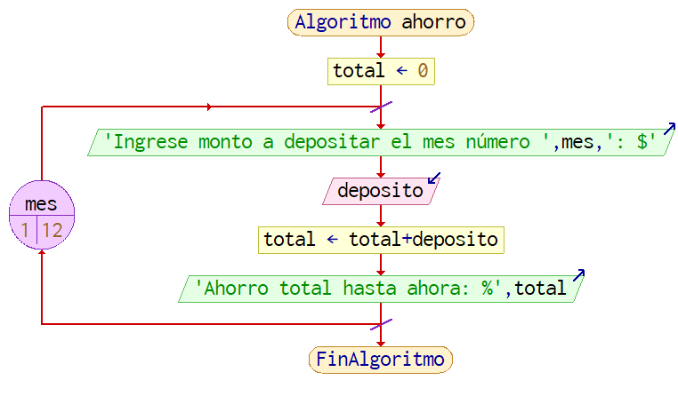

Actividades del día 2, semana 3.

(Martes 11 de mayo de 2021)

---

#### 1. El consultorio del Dr. Lorenzo T. Mata Lozano tiene como política cobrar la consulta con base en el número de cita, de la siguiente forma:
#### - Las tres primeras citas a $20.000 c/u.
#### - Las siguientes dos citas a $15.000 c/u.
#### - Las tres siguientes citas a $10.000 c/u.
#### - Las restantes a $5.000 c/u mientras dure el tratamiento.
#### Se requiere un algoritmo para determinar:
#### - Cuánto pagará el paciente por la cita.
#### - El monto de lo que ha pagado el paciente por el tratamiento.
#### Para la solución de este problema se requiere saber el número de cita  que se efectuará, con el cual se podrá determinar el costo que tendrá la consulta y cuánto se ha gastado en el tratamiento.

```
largo_tramo_A = 3
largo_tramo_B = 2
largo_tramo_C = 3
// largo_tramo_D = sin límite.

tarifa_tramo_A = 20000
tarifa_tramo_B = 15000
tarifa_tramo_C = 10000
tarifa_tramo_D =  5000

escribir "Ingrese el número de la última cita :"
leer nro_cita

si nro_cita <= largo_tramo_A
  costo_cita_actual = tarifa_tramo_A  
  citas_en_tramo_A = nro_cita
si no
  citas_en_tramo_A = largo_tramo_A
  si nro_cita <= largo_tramo_A + largo_tramo_B
    costo_cita_actual = tarifa_tramo_B
    citas_en_tramo_B = nro_cita - largo_tramo_A
  si no
    citas_en_tramo_B = largo_tramo_B
    si nro_cita <= largo_tramo_A + largo_tramo_B + largo_tramo_C
      costo_cita_actual = tarifa_tramo_C
      citas_en_tramo_C = nro_cita - (largo_tramo_A + largo_tramo_B)
    si no
      citas_en_tramo_C = largo_tramo_C
      costo_cita_actual = tarifa_tramo_D
      citas_en_tramo_D = nro_cita - (largo_tramo_A + largo_tramo_B + largo_tramo_C)
    fin si
  fin si
fin si

costo_pasado = 
    (citas_en_tramo_A * tarifa_tramo_A)
  + (citas_en_tramo_B * tarifa_tramo_B)
  + (citas_en_tramo_C * tarifa_tramo_C)
  + (citas_en_tramo_D * tarifa_tramo_D)
  - costo_cita_actual

escribir "El costo de la cita actual es: $" + costo_cita_actual
escribir "El costo total hasta ahora es: $" + costo_pasado
```


#### 2. Fábricas "El Cometa" produce artículos con claves (1, 2, 3, 4, 5 y 6). Se requiere un algoritmo para calcular los precios de venta. Para esto hay que considerar lo siguiente: costo de producción = materia prima + mano de obra + gastos de fabricación. Precio de venta = costo de producción + 45% de costo de producción. El costo de la mano de obra se obtiene de la siguiente forma: para los productos con clave 3 ó 4 se carga 75% del costo de la materia prima; para los que tienen clave 1 y 5 se carga 80%, y para los que tienen clave 2 ó 6, 85%.

#### Para calcular el gasto de fabricación se considera que si el artículo que se va a producir tiene claves 2 ó 5 este gasto representa 30% sobre el costo de la materia prima; si las claves son 3 ó 6, representa el 35%; si las claves son 1 ó 4, representa 28%. La materia prima tiene el mismo costo para cualquier clave.

```
escribir "Ingrese el código del artículo (1, 2, 3, 4, 5): "
leer codigo
escribir "Ingrese el costo de la materia prima: "
leer materia_prima

segun codigo
  1 o 4:
    gasto_fabricacion = materia_prima * 0.28
  2 o 5:
    gasto_fabricacion = materia_prima * 0.3
  3 o 6:
    gasto_fabricacion = materia_prima * 0.35
fin segun

segun codigo
  1 o 5:
    mano_de_obra = materia_prima * 0.8
  2 o 6:
    mano_de_obra = materia_prima * 0.85
  3 o 4:
    mano_de_obra = materia_prima * 0.75
fin segun

costo_producción = materia_prima + mano_de_obra + gastos_fabricación
precio_venta = costo_producción * 1.45

escribir "Precio de venta: $" + precio_venta
```


#### 3. Se requiere un algoritmo para obtener la suma de diez cantidades mediante la utilización de un ciclo "para".

```
suma = 0
para i de 1 hasta 10
  suma = suma + i
fin para
escribir suma
```


#### 4. Se requiere el algoritmo para obtener la edad promedio de un grupo de N alumnos.

```
suma = 0
cont = 0

hacer
  escribir "Ingrese edad (ó 0 para terminar): "
  leer edad
  suma = edad + nota
  cont = cont + 1
mientras edad >= 1

promedio = suma / cont

escribir "El promedio es: " + promedio

```


#### 5. Se requiere un algoritmo para determinar cuánto ahorrará una persona en un año si al final de cada mes deposita variables cantidades de dinero. Además, se requiere saber cuánto lleva ahorrado cada mes.

```
total = 0
para mes = 1 hasta 12
  escribir "Ingrese monto a depositar el mes número " + mes + ": $"
  leer deposito
  total = total + deposito
  escribir "Ahorro total hasta ahora: %" + total
fin para
```




#### 6. Se requiere un algoritmo para determinar, de N cantidades, cuántas son menores o iguales a 0 y cuántas mayores a 0.

```
cont_menores_o_iguales_a_cero = 0
cont_mayores_a_cero = 0

repetir
  escribir "Ingrese un número: "
  leer numero
  si numero <= cero
    cont_menores_o_iguales_a_cero = cont_menores_o_iguales_a_cero + 1
  si no
    cont_mayores_a_cero = cont_mayores_a_cero + 1
  fin si
  escribir "¿Desea seguir? (si / no): "
  leer seguir
hasta que seguir = "no"

escribir "La cantidad de números menores o iguales a cero es: " + cont_menores_o_iguales_a_cero
escribir "La cantidad de números mayores a cero es: " + cont_mayores_a_cero
```


#### 7. Una empresa tiene el registro de las horas que trabaja diariamente un empleado durante la semana (seis días) y requiere determinar el total de éstas, así como el sueldo que recibirá por las horas trabajadas.

```
escribir "Ingrese el sueldo por hora: "
leer sueldo_por_hora
total_horas = 0

para dia = 1 hasta 6
  escribir "Ingrese horas trabajadas el día " + dia + ": "
  leer horas
  total_horas = total_horas + horas
fin para

sueldo_total = sueldo_por_hora * total_horas

escribir "El total de horas trabajadas es: " + total_horas
escribir "El sueldo por las horas trabajadas es: $" + sueldo_total
```

